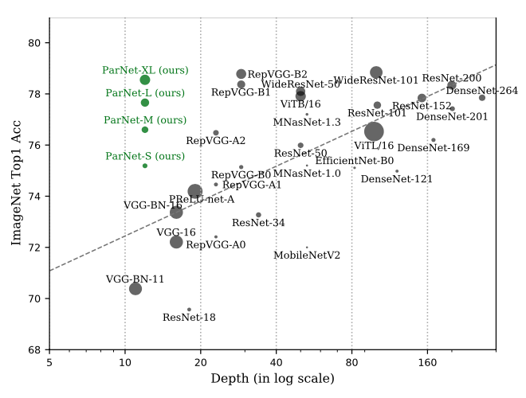

[**Non-deep Networks**](https://arxiv.org/abs/2110.07641) <br>
***NeurIPS 2022*** <br>
[Ankit Goyal](http://imankgoyal.github.io), [Alexey Bochkovskiy](http://www.alexeyab.com/), [Jia Deng](https://www.cs.princeton.edu/~jiadeng/), [Vladlen Koltun](http://vladlen.info/)<br/>

<div align="justify">
<i><b>Overview</b>: Depth is the hallmark of DNNs. But more depth means more sequential computation and higher latency. This begs the question -- is it possible to build high-performing ``non-deep" neural networks? We show that it is. We show, for the first time, that a network with a depth of just 12 can achieve top-1 accuracy over 80% on ImageNet, 96% on CIFAR10, and 81% on CIFAR100. We also show that a network with a low-depth (12) backbone can achieve an AP of 48% on MS-COCO.</i>
</div><br>

If you find our work useful, please consider citing it:
```
@article{goyal2021nondeep,
  title={Non-deep Networks},
  author={Goyal, Ankit and Bochkovskiy, Alexey and Deng, Jia and Koltun, Vladlen},
  journal={arXiv:2110.07641},
  year={2021}
}
```
